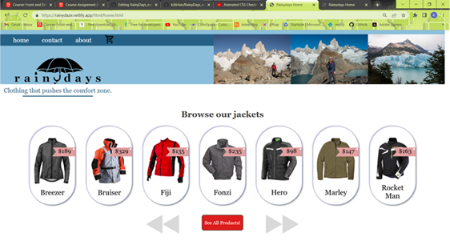

# Rainydays Jacket Company 

This is the e-commerce website for the Rainydays Jacket Company.
It is designed to be an attractive, user friendly and effective site that works well for 
both the end user and the company that would be paying for the service of having this 
website built.

________________________________________________________________________________________

The Landing Page:

In the protoype design, this page was built to give the site a stylish introduction that
conveyed the stylish products that are sold on the site, while maintaining the image of 
ruggedness by including the images of mountains, fog and a woman standing in the rain and
wind.  Made with large cta links and simple navigation links to move quickly into the site
itself after the first impression is made.

The Home Page:

The header and product carousel give a quick introduction to the site and the products 
being sold therein, while giving an interactive experience with the scrollable, clickable
product carousel.

The About / Contact Pages:

The desktop version includes the contact and about pages and can be navigated to using the 
fixed top nav bar that is fixed to the viewport so that it is accessible from the entire 
page on all pages.  As the page scales down to a mobile version, this nav bar is removed
from view and is replaced by a "thumb slider" hamburger menu.  Within this hamburger menu
is found the new contact and about links, which in this case navigate to a single-page
version of the page.  In a larger screen size there is more real estate to cover with 
content, in contrast to the mobile screen size where more than one piece of content can 
feel cluttered and overwhelming.

The Product Page:

A clear grid setup of the available products.  Linked images provide an easy gateway to 
the individual product with additional information including pricing and a cta link to add
the item to the cart, and proceed to checkout and payment.

The Cart Page:

A simplified version as opposed to the Figma Design File.  There were several situations
that required a judgement call when coding form the prototype.  As this is the first page 
I have worked on from beginning to end, there was things to learn about the process and 
what works best in regards to creating a user experience that is simple enough to be 
digested easily by the consumer but maintaining an aesthetic appeal that helps support a 
positive user experience.

The Checkout Page:

Straight to the point.  The user has chosen the product they would like to purchase, now 
let's finish the process quickly and effectively.

The Checkout Success Page:

This page serves as a confirmation that payment was completed, order received by the 
company, and additional information about shipping etc. is on the way.

Final Thoughts:

Moving through the project it was a true struggle to gain a solid grasp on the concepts 
behind CSS and styling.  HTML is quite straight forward as you are only putting the content 
onto the page.  Although, truly semantic HTML is an art in itself.  

______________________________________________________________________

This website was designed using Figma, coded with VSCode in conjunction with developer tools in Google Chrome.  Portions of this design were made in Illustrator and Photoshop by me.

_______________________________________________________________________

References:

Images taken from Unsplash.Com
Logo and diverse icons designmed by me

Information gathered from teaching Modules in the course, Youtube (mostly kevin powell), 
teacher Abidev and fellow students Linda, Brain and Fredrik.

________________________________________________________________________

Appendices:

To access website follow link to the Rainydays Landing page and website:

[Rainydays Jacket Co.](https://rainydaze.netlify.app)
[Rainydays Design File](https://www.figma.com/file/iBi0sEjE58tLwpE1TCcSz6/Rainydays%2F2.0?node-id=1%3A90&t=KilxVz7PgUBgBL0g-1)
[Github Repo](https://github.com/kJAHsin/RainyDays_netlify)
